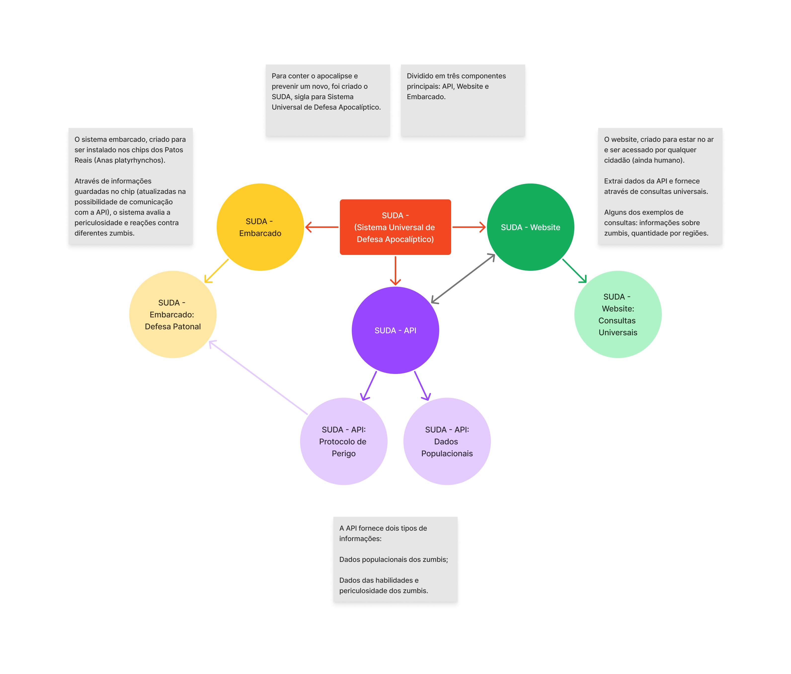

# SUDA - Sistema Universal de Defesa Apocalíptico.

Para vencer o fim do mundo — o apocalipse zumbi — apresentamos o SUDA, sigla para Sistema Universal de Defesa Apocalíptico. 

Uma rede com informações e dados, além de funções, para o auxílio na luta contra os infectados.

---

<div align="end">
  <small>
    Desenvolvido por <a href="https://github.com/pedrohaveloso">pedrohaveloso</a> 💙 durante o <a href="https://oficial.unimar.br/eventos/bootcamp-jovem-programador/">Bootcamp Jovem Programador 2023</a>. 
  </small>
  <br />
  <small>
    <address>
      E-mail: 
      <a href="mailto:contatopedrohalves@gmail.com">
        <em>contatopedrohalves@gmail.com</em>
      </a>
      <br />
      WhatsApp:
      <a href="tel:+5514981838507">
        <em>14 98183-8507</em>
      </a>
    </address>
  </small>
</div>

---

# 🗒️ Sumário.

- [📜 Resumo.](#-resumo)
- [🚨 Como rodar o projeto.](#-como-rodar-o-projeto)
- [🧐 Como utilizar?](#-como-utilizar)
- [🤔 Por quê?](#-por-quê)
- [📄 Documentações...](#-documentações)

# 📜 Resumo.

O SUDA foi dividido em três principais frentes (projetos), cada um com seu objetivo. São elas:

- `SUDA - API`
  - Protocolo de Perigo
  - Dados Populacionais
- `SUDA - Website`
  - Consultas Universais
- `SUDA - Embarcado`
  - Defesa Patonal

Abaixo, um diagrama explicando  melhor cada componente do SUDA:


# 🚨 Como rodar o projeto.

Você tem duas opções para rodar e testar esse projeto: usando Docker (mais rápido e confiável) ou com o Dart SDK.

Vou ensinar as duas formas nesse tópico, mas, primeiramente, você deve fazer algo antes de realizar qualquer uma delas, clonar o projeto:

```shell
git clone https://github.com/PedroHAVeloso/suda.git
```

Depois de clonado, basta entrar na pasta do projeto:

```shell
cd suda
``` 

Feito essas duas etapas, vamos para o que mais interessa:

**Se preferir o Docker:**
<details>
  <summary>📦️ Rodando o projeto com Docker.</summary>

  ### Vamos usar a magia do Docker para rodar?
  
  > Deixando claro: você vai precisar do [Docker](https://www.docker.com/) e do [Docker Compose](https://docs.docker.com/compose/) (mais especificamente: o Compose V2). Não vou ensinar como os instalar, clicando nos nomes deles você já terá o tutorial disso.

  Primeiramente, você precisa buildar as imagens do projeto, para isso, feito os passos anteriores (clonar o repositório e entrar na pasta dele), cole o seguinte comando no terminal:

  ```shell
  docker compose build
  ```

  Talvez demore um pouco, após finalizar, bastará iniciar os containers.

  > Deixando outro aviso: as portas 7875, 7880 e 7885 serão necessárias para esses containers e para o funcionamento do projeto, espero que elas não sejam usadas no seu computador 🙂.

  Cole o comando abaixo para criar os containers:

  ```shell
  docker compose up -d
  ```

  Pronto! Parabéns, você fez o projeto rodar. Agora, para usar o SUDA - Website, basta entrar no seu navegador no http://localhost:7880. Se quiser usar a SUDA - API, ela está no http://localhost:7875. Ademais, caso queira testar o SUDA - Embarcado, você precisará seguir os passos adicionais abaixo:

  ```shell
  docker compose exec embedded bash

  dart bin/main.dart
  ```

  Para mais detalhes de como usar cada um, vá para o tópico [🧐 Como utilizar?](#-como-utilizar).

</details>

**Se preferir o Dart SDK:**
<details>
  <summary>🎯 Rodando o projeto com o Dart SDK.</summary>

  ### Pelo jeito você usa Dart, hein... Vamos lá.
  
  > A princípio, é claro, você deve ter o [Dart SDK](https://dart.dev/get-dart) instalado na sua máquina. Confirmado isso, prossiga.

  Ao clonar e entrar na pasta do projeto, você deve ter notado que ele está divido em três pastas. Recomendo você abrir 3 terminais. Um em cada pasta (api, website, embedded).

  Dentro da pasta api, instale o Dart Frog:
  
  `$ suda/api/`
  ```shell
  dart pub global activate dart_frog_cli
  ```

  Após isso, instale todas as dependências da API:
  ```shell
  dart pub get
  ```  

  Por final, inicie a API:
  ```shell
  dart_frog dev --port 7875
  ```

  **Pronto, a SUDA - API estará rodando na sua máquina. Vamos para o próximo: o SUDA - Website.**
  
  Dentro da pasta do website, no outro terminal, instale o Dart Webdev:

  `$ suda/website/`
  ```shell
  dart pub global activate webdev
  ```

  Feito a instalação, instale todas as dependências do website:
  ```shell
  dart pub get
  ```  

  Agora, inicie o site:
  ```shell
  webdev serve web:7880
  ```

  **Você também terá o site do sistema funcionando no seu computador. A seguir, o último passo: SUDA - Embarcado.**

  No terceiro terminal que você abriu, instale as dependências do embarcado:
  
  `$ suda/embedded/`
  ```shell
  dart pub get
  ``` 

  E inicie o programa de terminal:
  ```shell
  dart bin/main.dart
  ```

  **O SUDA - Embarcado também estará rodando na sua máquina. Parabéns!**
</details>

# 🧐 Como utilizar?

Para usar, é simples: 

A API está disponível no endereço http://localhost:7875, para mais detalhes sobre as rotas, consulte o tópico [Documentação](#-documentações).

O website está disponível no endereço http://localhost:7880.

O embarcado pode ser acessado pelo terminal do Docker usando:
```shell
docker compose exec embedded bash

dart bin/main.dart
```
Ou com o Dart SDK na pasta `./suda/embedded` com:
```shell
dart bin/main.dart
```

# 🤔 Por quê?

> Explicarei, neste tópico, o motivo das principais escolhas feitas no projeto, como as tecnologias usadas.

### Primeiramente, destaco o principal: o uso de Dart em tudo.

De início, ao avaliar como realizaria o desafio, pensei em dividir ele nos três ramos que você já deve ter visto aqui. Um site, um embarcado e uma API. 

Na hora pensei: vou tentar fazer algo com Dart. Pessoalmente, gosto da linguagem, acho agradável de usar e tem suas aplicações. Para fazer um aplicativo "embarcado" que funcionasse pelo terminal, além de uma API simples, seria fácil. Entretanto, para fazer um site... 

#### O site.

Eu teria algumas opções — pode-se perguntar, claro, por que não criar um site comum e simples apenas com Javascript? Eu te respondo: por birra de fazer tudo em Dart 😅 — a primeira delas: Flutter.

Descartei em pouco tempo. Todos que já programaram usando Flutter sabem, seu desempenho e o seu vislumbrar para aplicativos multiplataforma, principalmente iOS e Android, são fenomenais. Contudo, para a web, ele peca muito. É pesado e lento.

A próxima opção seria Dart puro. Não há nenhum outro framework Dart para web tão conhecido (se algum dia ocorreu de um ser conhecido — jaz em paz AngularDart, que a Google o tenha), estou certo?

Comecei a ir com Dart puro, teria apenas dificuldades para componentizar, mas não seria um site tão grande para isso. Após alguns feitos com HTML, TailwindCSS (optei por ele, mais prático) e Dart, deparei-me com algo interessante: [Deact](https://pub.dev/packages/deact).

O Deact é um framework web em Dart, creio que pouco conhecido, eu mesmo não tinha houvido falar dele anteriormente, não que a minha pessoa seja parâmetro para isso, conheço poucas coisas. Mas a web é um parâmetro e existem poucas coisas sobre ele nela 😭.

A documentação é satisfatória e o uso também. Ele injeta uma essência de programar em Flutter. Não tem um esquema como o JSX do React. Tem um controle de estado, reffs etc. ótimo, pelo menos em minha avaliação.

Em resumo, um conhecimento a mais conquistado para solucionar o desafio. O Deact apenas possui algums problemas com carregamento de coisas assíncronas, mas nada que uma mudança de estado aqui e ali não resolveu.

#### A API.

Por outro lado, em contraponto às dúvidas que tive em como criar o site, na API eu já estava decidido desde o começo: [Dart Frog](https://dartfrog.vgv.dev/).

O Dart Frog é um framework ótimo para criar uma API de maneira rápida e minimalista. Ele já faz parte do trabalho que seria necessário usando apenas Shelf. Mesmo assim, não deixa a desejar em nenhum quesito.

Tem tudo necessário para uma boa API, no que se propõe, é fenomenal. Sempre utilizei quando precisei fazer algo nesse cenário. A documentação dele é ótima, fácil de leitura e de se compreender.

#### O embarcado.

Aqui, a explicação se torna a mais curta. Usei apenas Dart. Um projeto básico para console, nada complexo. No máximo, uma dependência (http) para comunicação com a API. Nada mais. 

### Outras decisões...

Além de escolher a base da criação de cada parte do sistema que, como já dito anteriormente, foi feito completamente em Dart, ao longo do projeto também tomei algumas outras decisões corriqueiras. Cabe-se mencionar, nesse pequeno trecho, algumas delas:

- **TailwindCSS**: para estilização do site, com o objetivo de manter um visual minimamente descente (na medida das habilidades do programador quem vos fala). Deixou o processo de estilização mais rápido, bom pelo curto tempo de desenvolvimento.

- **JSON ao invés de um banco estruturado**: na construção da API e, um pouco após, na construção do embarcado, precisei de alguma opção para armazenar as informações do sistema. Para isso, preferi optar por arquivos JSON. Claro, ao longo do tempo, de maneira especulativa, caso houvesse uma injeção maior de dados, esse armazenamento não seria eficiente. Entretanto, organizei as camadas da API para facilitar a troca do tipo de banco de dados. O que está no mais alto nível não depende do que está no mais baixo nível e, ao invés disso, apenas usa uma interface comum entre os dois, um pouco de arquitetura limpa aplicada em um projeto tão pequeno. 

# 📄 Documentações...

> Em geral, os arquivos, classes, funções e todo código criado já foi documentado, para saber, entre nos arquivos. Ademais, esse tópico apenas terá a documentação para requisições e respostas da API.

## Rotas da API.

### Listar todos os zumbis

`GET /zombies`

Resposta (tipos):

```
{
  "id": string,
  "location": {
    "country": string,
    "state": string,
    "city": string
  },
  "age": int,
  "gender": int,
  "weight": double,
  "height": double,
  "blood_type": string,
  "musics": <string>[],
  "games": <string>[],
  "sports": <string>[]
} []
```

Resposta (exemplo):

`200`, corpo:

```json
[
  {
    "id": "AjGRFsai234u90SADFV435230Msadc3412asdzS",
    "location": {
      "country": "BRA",
      "state": "SP",
      "city": "Marília"
    },
    "age": 20,
    "gender": 1,
    "weight": 60.0,
    "height": 1.8,
    "blood_type": "A+",
    "musics": [],
    "games": [],
    "sports": []
  },

  ...
]
```

### Adicionar um zumbi

`POST /zombies`

Requisição, corpo (tipos):

```
{
  "location": {
    "country": string,
    "state": string,
    "city": string
  },
  "age": int,
  "gender": int,
  "weight": double,
  "height": double,
  "blood_type": string,
  "musics": <string>[],
  "games": <string>[],
  "sports": <string>[]
}
```

Requisição, corpo (exemplo):

```json
{
  "location": {
    "country": "BRA",
    "state": "SP",
    "city": "Marília"
  },
  "age": 20,
  "gender": 1,
  "weight": 60.0,
  "height": 1.8,
  "blood_type": "A+",
  "musics": [],
  "games": [],
  "sports": []
}
```

Resposta (exemplo):

`200`

# ❤️ Agradecimentos.

Concluindo esse leia-me, agradeço a DSIN e sua equipe, pela realização do desafio [DSIN CODER CHALLENGE](https://coderchallenge.dsin.com.br).

---

<div align="end">
  <small>
    Desenvolvido por <a href="https://github.com/pedrohaveloso">pedrohaveloso</a> 💙 durante o <a href="https://oficial.unimar.br/eventos/bootcamp-jovem-programador/">Bootcamp Jovem Programador 2023</a>. 
  </small>
  <br />
  <small>
    <address>
      E-mail: 
      <a href="mailto:contatopedrohalves@gmail.com">
        <em>contatopedrohalves@gmail.com</em>
      </a>
      <br />
      WhatsApp:
      <a href="tel:+5514981838507">
        <em>14 98183-8507</em>
      </a>
    </address>
  </small>
</div>

---